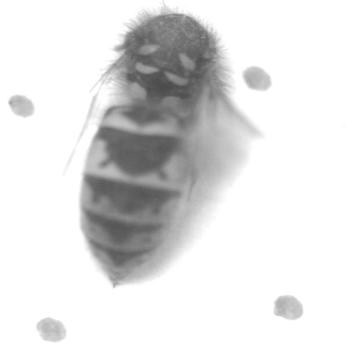

# Go-Extended Depth of Field

This Go program takes a stack of PGM images with different focuses and creates an extended depth of field (EDOF) image by combining all the sharp details from each image in the stack.
## Features

Combines multiple PGM images with different focus points into a single EDOF image
Automatically detects and uses the sharpest regions from each image in the stack
Simple command-line interface for easy usage

## Limitations

Currently, this program does not align the images, and thus objects are assumed to be aligned across all images in the stack.

## Prerequisites

Go programming language installed on your system

## Installation

### Clone the repository:

``` 
git clone https://github.com/TomasMen/go-edof.git
```

### Change to the project directory:

``` 
cd go-edof
```

## Usage

1. Create a file named stack.txt in the project directory and list the names of the PGM images you want to stack, one per line.
2. Place the PGM images either in the same directory as the main.go file or in a ./stack/ subdirectory.
3. Run the program using one of the following methods:

### Using go run:

``` 
go run main.go stack.txt
```

### Building and running the executable:
```
go build main.go
./main stack.txt
```

The program will process the images and generate an EDOF image named result.pgm in the same directory.

## Examples

Here's an example of the program's input and output:

<div style="display:flex;">
  
  
  
</div>

<div style="text-align:center;">
  
</div>

To reproduce this example:

1. Create `stack.txt` with the following content:
```
wasp1.pgm
wasp2.pgm
wasp3.pgm
```
2. Place the corresponding PGM images (`wasp1.pgm`, `wasp2.pgm`, `wasp3.pgm`) (which can be found in the `./examples/example1/` directory) in the ./stack/ directory or in the base directory.
3. Run the program:
```
go run main.go stack.txt
```
4. The program will generate an EDOF image named `edof.pgm` in the same directory.

More examples can be found under the ./examples/ directory.

## Contributing

Contributions to this package are welcome! If you find any issues or have suggestions for improvements, please open an issue or submit a pull request on the GitHub repository.
License

This package is licensed under the MIT License. See the LICENSE file for more information.

## Acknowledgments

- This Go program is a reimplementation of a Python script I created for a computer vision module assignment at my university. The reimplementation process served as an opportunity to deepen my understanding of Go and explore its potential for computer vision tasks.

